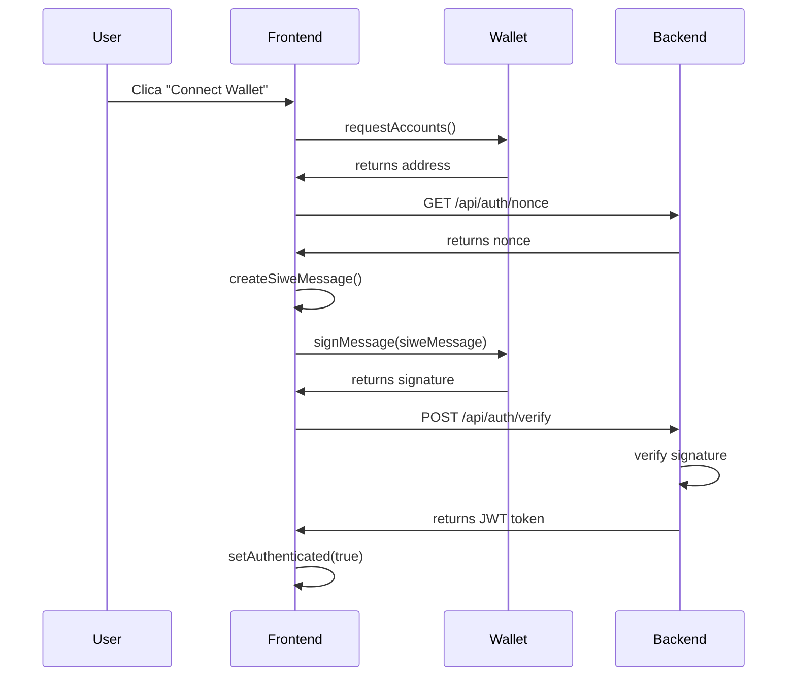

# 🔗 BLOCKCHAIN DOCUMENTATION - ENVIMERSE

## 📋 **OVERVIEW**

Esta documentação detalha todos os aspectos blockchain da plataforma Envimerse, incluindo fluxos SIWE, integração de chains, on-ramp widgets e contratos inteligentes.

---

## 🔐 **FLUXOS SIWE (Sign-In With Ethereum)**

### **1. Fluxo Básico de Autenticação**



### **2. Implementação do Fluxo SIWE**

#### **Frontend (Cliente)**
```typescript
import { useSIWE } from '@/hooks/useSIWE';

function AuthButton() {
  const { 
    signIn, 
    signOut, 
    isAuthenticated, 
    isSigning, 
    session 
  } = useSIWE();

  const handleSignIn = async () => {
    const success = await signIn();
    if (success) {
      console.log('✅ Autenticado com sucesso!');
    }
  };

  if (isAuthenticated) {
    return (
      <div>
        <p>Conectado: {session?.address}</p>
        <button onClick={signOut}>Desconectar</button>
      </div>
    );
  }

  return (
    <button onClick={handleSignIn} disabled={isSigning}>
      {isSigning ? 'Assinando...' : 'Entrar com Ethereum'}
    </button>
  );
}
```

#### **Backend API Routes**

**Gerar Nonce:**
```typescript
// pages/api/auth/nonce.ts
import type { NextApiRequest, NextApiResponse } from 'next';
import { randomBytes } from 'crypto';

export default function handler(req: NextApiRequest, res: NextApiResponse) {
  if (req.method !== 'GET') {
    return res.status(405).json({ error: 'Method not allowed' });
  }

  const nonce = randomBytes(32).toString('hex');
  
  // Store nonce in session/database with expiration
  req.session.nonce = nonce;
  req.session.nonceExpires = Date.now() + 10 * 60 * 1000; // 10 minutes
  
  res.status(200).json({ nonce });
}
```

**Verificar Assinatura:**
```typescript
// pages/api/auth/verify.ts
import type { NextApiRequest, NextApiResponse } from 'next';
import { SiweMessage } from 'siwe';
import jwt from 'jsonwebtoken';

export default async function handler(req: NextApiRequest, res: NextApiResponse) {
  if (req.method !== 'POST') {
    return res.status(405).json({ error: 'Method not allowed' });
  }

  try {
    const { message, signature } = req.body;
    const storedNonce = req.session.nonce;
    
    // Verify nonce hasn't expired
    if (!storedNonce || Date.now() > req.session.nonceExpires) {
      return res.status(400).json({ error: 'Invalid or expired nonce' });
    }

    // Parse and verify SIWE message
    const siweMessage = new SiweMessage(message);
    const fields = await siweMessage.verify({ signature });
    
    if (!fields.success) {
      return res.status(400).json({ error: 'Invalid signature' });
    }

    // Verify nonce matches
    if (fields.data.nonce !== storedNonce) {
      return res.status(400).json({ error: 'Nonce mismatch' });
    }

    // Create JWT token
    const token = jwt.sign(
      { 
        address: fields.data.address,
        chainId: fields.data.chainId,
        iat: Math.floor(Date.now() / 1000),
        exp: Math.floor(Date.now() / 1000) + (24 * 60 * 60), // 24 hours
      },
      process.env.JWT_SECRET!
    );

    // Clear nonce
    delete req.session.nonce;
    delete req.session.nonceExpires;

    res.status(200).json({ 
      token,
      user: {
        address: fields.data.address,
        chainId: fields.data.chainId,
      }
    });
  } catch (error) {
    console.error('SIWE verification error:', error);
    res.status(500).json({ error: 'Verification failed' });
  }
}
```

### **3. Middleware de Autenticação**

```typescript
// middleware/auth.ts
import jwt from 'jsonwebtoken';
import type { NextApiRequest, NextApiResponse } from 'next';

export interface AuthenticatedRequest extends NextApiRequest {
  user: {
    address: string;
    chainId: number;
  };
}

export function withAuth(handler: Function) {
  return async (req: AuthenticatedRequest, res: NextApiResponse) => {
    try {
      const authHeader = req.headers.authorization;
      if (!authHeader?.startsWith('Bearer ')) {
        return res.status(401).json({ error: 'No token provided' });
      }

      const token = authHeader.substring(7);
      const decoded = jwt.verify(token, process.env.JWT_SECRET!) as any;
      
      req.user = {
        address: decoded.address,
        chainId: decoded.chainId,
      };

      return handler(req, res);
    } catch (error) {
      return res.status(401).json({ error: 'Invalid token' });
    }
  };
}
```

---

## 🌐 **COMO ADICIONAR NOVAS CHAIN IDs**

### **1. Configuração de Chain**

```typescript
// src/lib/wallet.ts

// 1. Import a nova chain
import { scroll } from 'wagmi/chains'; // Exemplo: Scroll

// 2. Adicionar à configuração de chains suportadas
export const supportedChains = [
  mainnet,
  base,
  polygon,
  arbitrum,
  optimism,
  scroll, // ← Nova chain
] as const;

// 3. Configurar transport RPC
export const wagmiConfig = createConfig({
  chains: supportedChains,
  connectors,
  transports: {
    [mainnet.id]: http(/* ... */),
    [base.id]: http(/* ... */),
    [polygon.id]: http(/* ... */),
    [arbitrum.id]: http(/* ... */),
    [optimism.id]: http(/* ... */),
    [scroll.id]: http(), // ← Transport para nova chain
  },
  ssr: true,
});
```

### **2. Adicionar Endereços de Contratos**

```typescript
// src/lib/wallet.ts

export const CONTRACT_ADDRESSES = {
  [mainnet.id]: {
    vrTicketNFT: '0x...' as Address,
    marketplace: '0x...' as Address,
  },
  // ... outras chains
  [scroll.id]: { // ← Nova chain
    vrTicketNFT: '0x...' as Address,
    marketplace: '0x...' as Address,
  },
} as const;
```

### **3. Configurar Tokens de Pagamento**

```typescript
// src/lib/wallet.ts

export const PAYMENT_TOKENS = {
  [mainnet.id]: [
    { address: '0x...', symbol: 'USDC', decimals: 6 },
  ],
  // ... outras chains
  [scroll.id]: [ // ← Nova chain
    { address: '0x...', symbol: 'USDC', decimals: 6 },
  ],
} as const;
```

### **4. Atualizar Hook de Wallet**

```typescript
// src/hooks/useUserWallet.ts

const getNetworkName = (): string => {
  switch (chainId) {
    case 1: return 'Ethereum';
    case 137: return 'Polygon';
    case 8453: return 'Base';
    case 42161: return 'Arbitrum';
    case 10: return 'Optimism';
    case 534352: return 'Scroll'; // ← Nova chain
    default: return 'Unknown Network';
  }
};
```

### **5. Configurar Variáveis de Ambiente**

```bash
# .env.local

# Scroll RPC (exemplo)
NEXT_PUBLIC_SCROLL_RPC_URL=https://rpc.scroll.io

# Contract addresses para Scroll
NEXT_PUBLIC_SCROLL_VR_TICKET_NFT=0x...
NEXT_PUBLIC_SCROLL_MARKETPLACE=0x...
```

---

## 💳 **INTEGRAÇÃO DE ON-RAMP WIDGET**

### **1. Configuração do OnRamper**

```typescript
// src/components/OnRampWidget.tsx
import { useState } from 'react';
import { useUserWallet } from '@/hooks/useUserWallet';

interface OnRampWidgetProps {
  isOpen: boolean;
  onClose: () => void;
  targetAmount?: number;
  targetCurrency?: string;
}

export function OnRampWidget({ 
  isOpen, 
  onClose, 
  targetAmount, 
  targetCurrency = 'ETH' 
}: OnRampWidgetProps) {
  const { address, chainId } = useUserWallet();
  const [isLoading, setIsLoading] = useState(false);

  const onRamperConfig = {
    // Configuração básica
    appName: 'Envimerse',
    apiKey: process.env.NEXT_PUBLIC_ONRAMPER_API_KEY,
    
    // Configuração do usuário
    walletAddress: address,
    defaultCrypto: targetCurrency,
    defaultAmount: targetAmount,
    
    // Configuração de chains
    cryptoCurrencies: {
      ETH: {
        chainId: 1,
        address: '0x0000000000000000000000000000000000000000',
      },
      'ETH-BASE': {
        chainId: 8453,
        address: '0x0000000000000000000000000000000000000000',
      },
      'MATIC': {
        chainId: 137,
        address: '0x0000000000000000000000000000000000000000',
      },
      'USDC-ETH': {
        chainId: 1,
        address: '0xA0b86a33E6441f8C89f027ed5F3bEd9b8d7C4B1E',
      },
    },
    
    // Callbacks
    onSuccess: (data: any) => {
      console.log('On-ramp success:', data);
      onClose();
    },
    onError: (error: any) => {
      console.error('On-ramp error:', error);
    },
  };

  if (!isOpen) return null;

  return (
    <div className="fixed inset-0 z-50 bg-black/50 flex items-center justify-center">
      <div className="bg-gray-900 p-6 rounded-lg max-w-md w-full mx-4">
        <div className="flex justify-between items-center mb-4">
          <h3 className="text-xl font-bold text-white">Comprar Crypto</h3>
          <button onClick={onClose} className="text-gray-400 hover:text-white">
            ✕
          </button>
        </div>
        
        {/* OnRamper Widget Iframe */}
        <iframe
          src={`https://widget.onramper.com?${new URLSearchParams({
            apiKey: onRamperConfig.apiKey!,
            defaultCrypto: targetCurrency,
            defaultAmount: targetAmount?.toString() || '100',
            walletAddress: address || '',
            ...onRamperConfig
          }).toString()}`}
          width="100%"
          height="600"
          frameBorder="0"
          className="rounded-lg"
        />
      </div>
    </div>
  );
}
```

### **2. Hook para OnRamp**

```typescript
// src/hooks/useOnRamp.ts
import { useWeb3Store } from '@/lib/web3-store';

export function useOnRamp() {
  const { 
    onRampWidget, 
    openOnRampWidget, 
    closeOnRampWidget 
  } = useWeb3Store();

  const openOnRamp = (amount?: number, currency?: string) => {
    openOnRampWidget(amount, currency);
  };

  const closeOnRamp = () => {
    closeOnRampWidget();
  };

  return {
    isOpen: onRampWidget.isOpen,
    targetAmount: onRampWidget.targetAmount,
    targetCurrency: onRampWidget.targetCurrency,
    openOnRamp,
    closeOnRamp,
  };
}
```

### **3. Integração com Moonpay (Alternativa)**

```typescript
// src/lib/moonpay.ts
export const moonpayConfig = {
  apiKey: process.env.NEXT_PUBLIC_MOONPAY_API_KEY,
  environment: process.env.NODE_ENV === 'production' ? 'live' : 'sandbox',
  
  // Supported currencies
  currencies: {
    eth: 'eth',
    usdc: 'usdc',
    matic: 'matic_polygon',
    usdc_base: 'usdc_base',
  },
  
  // Generate widget URL
  getWidgetUrl: (params: {
    walletAddress: string;
    currencyCode: string;
    baseCurrencyAmount?: number;
    baseCurrencyCode?: string;
  }) => {
    const baseUrl = moonpayConfig.environment === 'live' 
      ? 'https://buy.moonpay.com'
      : 'https://buy-sandbox.moonpay.com';
    
    const searchParams = new URLSearchParams({
      apiKey: moonpayConfig.apiKey!,
      walletAddress: params.walletAddress,
      currencyCode: params.currencyCode,
      showWalletAddressForm: 'true',
      ...(params.baseCurrencyAmount && {
        baseCurrencyAmount: params.baseCurrencyAmount.toString(),
      }),
      ...(params.baseCurrencyCode && {
        baseCurrencyCode: params.baseCurrencyCode,
      }),
    });
    
    return `${baseUrl}?${searchParams.toString()}`;
  },
};
```

---

## 📜 **CONTRATOS INTELIGENTES**

### **1. VR Ticket NFT Contract**

```solidity
// contracts/VRTicketNFT.sol
pragma solidity ^0.8.19;

import "@openzeppelin/contracts/token/ERC721/ERC721.sol";
import "@openzeppelin/contracts/access/Ownable.sol";
import "@openzeppelin/contracts/utils/Counters.sol";

contract VRTicketNFT is ERC721, Ownable {
    using Counters for Counters.Counter;
    
    Counters.Counter private _tokenIdCounter;
    
    struct TicketInfo {
        uint256 eventId;
        uint8 ticketType;
        string metadata;
        bool isUsed;
    }
    
    mapping(uint256 => TicketInfo) public tickets;
    mapping(uint256 => uint256) public eventPrices;
    mapping(uint256 => bool) public eventExists;
    
    event TicketMinted(address indexed to, uint256 indexed tokenId, uint256 indexed eventId, uint8 ticketType);
    event TicketUsed(uint256 indexed tokenId, address indexed user);
    
    constructor() ERC721("VR Ticket", "VRTICKET") {}
    
    function mint(
        address to,
        uint256 eventId,
        uint8 ticketType,
        string memory metadata
    ) external payable returns (uint256) {
        require(eventExists[eventId], "Event does not exist");
        require(msg.value >= eventPrices[eventId], "Insufficient payment");
        
        uint256 tokenId = _tokenIdCounter.current();
        _tokenIdCounter.increment();
        
        tickets[tokenId] = TicketInfo({
            eventId: eventId,
            ticketType: ticketType,
            metadata: metadata,
            isUsed: false
        });
        
        _safeMint(to, tokenId);
        
        emit TicketMinted(to, tokenId, eventId, ticketType);
        return tokenId;
    }
    
    function useTicket(uint256 tokenId) external {
        require(ownerOf(tokenId) == msg.sender, "Not ticket owner");
        require(!tickets[tokenId].isUsed, "Ticket already used");
        
        tickets[tokenId].isUsed = true;
        emit TicketUsed(tokenId, msg.sender);
    }
    
    // Admin functions
    function createEvent(uint256 eventId, uint256 price) external onlyOwner {
        eventExists[eventId] = true;
        eventPrices[eventId] = price;
    }
    
    function getTicketPrice(uint256 eventId, uint8 ticketType) external view returns (uint256) {
        uint256 basePrice = eventPrices[eventId];
        
        // Price multipliers by ticket type
        if (ticketType == 1) return basePrice * 3; // VIP
        if (ticketType == 2) return basePrice * 5; // Backstage
        if (ticketType == 3) return basePrice * 2; // Early Access
        
        return basePrice; // General
    }
}
```

### **2. Marketplace Contract**

```solidity
// contracts/Marketplace.sol
pragma solidity ^0.8.19;

import "@openzeppelin/contracts/security/ReentrancyGuard.sol";
import "@openzeppelin/contracts/access/Ownable.sol";
import "./VRTicketNFT.sol";

contract Marketplace is ReentrancyGuard, Ownable {
    VRTicketNFT public vrTicketNFT;
    
    struct Listing {
        address seller;
        uint256 price;
        bool active;
    }
    
    mapping(uint256 => Listing) public listings;
    uint256 public marketplaceFee = 250; // 2.5%
    
    event TicketListed(uint256 indexed tokenId, address indexed seller, uint256 price);
    event TicketSold(uint256 indexed tokenId, address indexed buyer, address indexed seller, uint256 price);
    
    constructor(address _vrTicketNFT) {
        vrTicketNFT = VRTicketNFT(_vrTicketNFT);
    }
    
    function listTicket(uint256 tokenId, uint256 price) external {
        require(vrTicketNFT.ownerOf(tokenId) == msg.sender, "Not owner");
        require(vrTicketNFT.getApproved(tokenId) == address(this), "Contract not approved");
        
        listings[tokenId] = Listing({
            seller: msg.sender,
            price: price,
            active: true
        });
        
        emit TicketListed(tokenId, msg.sender, price);
    }
    
    function buyTicket(uint256 tokenId) external payable nonReentrant {
        Listing memory listing = listings[tokenId];
        require(listing.active, "Ticket not for sale");
        require(msg.value >= listing.price, "Insufficient payment");
        
        uint256 fee = (listing.price * marketplaceFee) / 10000;
        uint256 sellerAmount = listing.price - fee;
        
        listings[tokenId].active = false;
        
        vrTicketNFT.safeTransferFrom(listing.seller, msg.sender, tokenId);
        
        payable(listing.seller).transfer(sellerAmount);
        payable(owner()).transfer(fee);
        
        if (msg.value > listing.price) {
            payable(msg.sender).transfer(msg.value - listing.price);
        }
        
        emit TicketSold(tokenId, msg.sender, listing.seller, listing.price);
    }
}
```

---

## 🔧 **DEPLOYMENT & TESTING**

### **1. Deploy Script (Hardhat)**

```typescript
// scripts/deploy.ts
import { ethers } from "hardhat";

async function main() {
  // Deploy VR Ticket NFT
  const VRTicketNFT = await ethers.getContractFactory("VRTicketNFT");
  const vrTicketNFT = await VRTicketNFT.deploy();
  await vrTicketNFT.deployed();
  console.log("VRTicketNFT deployed to:", vrTicketNFT.address);
  
  // Deploy Marketplace
  const Marketplace = await ethers.getContractFactory("Marketplace");
  const marketplace = await Marketplace.deploy(vrTicketNFT.address);
  await marketplace.deployed();
  console.log("Marketplace deployed to:", marketplace.address);
  
  // Create sample event
  await vrTicketNFT.createEvent(1, ethers.utils.parseEther("0.1"));
  console.log("Sample event created");
}

main().catch((error) => {
  console.error(error);
  process.exitCode = 1;
});
```

### **2. Testing Script**

```typescript
// test/VRTicketNFT.test.ts
import { expect } from "chai";
import { ethers } from "hardhat";

describe("VRTicketNFT", function () {
  let vrTicketNFT: any;
  let owner: any;
  let addr1: any;
  
  beforeEach(async function () {
    [owner, addr1] = await ethers.getSigners();
    
    const VRTicketNFT = await ethers.getContractFactory("VRTicketNFT");
    vrTicketNFT = await VRTicketNFT.deploy();
    await vrTicketNFT.deployed();
    
    // Create test event
    await vrTicketNFT.createEvent(1, ethers.utils.parseEther("0.1"));
  });
  
  it("Should mint a ticket", async function () {
    const metadata = JSON.stringify({
      eventName: "Test Event",
      date: "2024-12-31"
    });
    
    await expect(
      vrTicketNFT.connect(addr1).mint(
        addr1.address,
        1,
        0,
        metadata,
        { value: ethers.utils.parseEther("0.1") }
      )
    ).to.emit(vrTicketNFT, "TicketMinted");
    
    expect(await vrTicketNFT.balanceOf(addr1.address)).to.equal(1);
  });
});
```

---

## 📚 **RECURSOS E LINKS**

### **Documentação Oficial**
- [Wagmi Docs](https://wagmi.sh) - React hooks para Ethereum
- [Viem Docs](https://viem.sh) - TypeScript interface para Ethereum
- [SIWE Docs](https://docs.login.xyz) - Sign-In With Ethereum
- [OnRamper Docs](https://docs.onramper.com) - Fiat-to-crypto on-ramp

### **Ferramentas de Desenvolvimento**
- [Hardhat](https://hardhat.org) - Framework de desenvolvimento Ethereum
- [OpenZeppelin](https://openzeppelin.com) - Contratos seguros
- [Tenderly](https://tenderly.co) - Debugging e monitoring

### **Testnets para Desenvolvimento**
- **Ethereum**: Sepolia (Chain ID: 11155111)
- **Polygon**: Mumbai (Chain ID: 80001)
- **Base**: Base Sepolia (Chain ID: 84532)

---

## ⚠️ **SEGURANÇA E BOAS PRÁTICAS**

### **1. Validação de Contratos**
- ✅ Sempre verificar endereços de contratos
- ✅ Usar ABIs tipadas com TypeScript
- ✅ Implementar rate limiting em APIs
- ✅ Validar todas as entradas de usuário

### **2. Gerenciamento de Chaves**
- ✅ Nunca expor chaves privadas no frontend
- ✅ Usar variáveis de ambiente para API keys
- ✅ Implementar rotação de chaves
- ✅ Monitorar uso de APIs

### **3. Tratamento de Erros**
- ✅ Implementar fallbacks para RPCs
- ✅ Tratar erros de rede graciosamente
- ✅ Fornecer feedback claro aos usuários
- ✅ Logs detalhados para debugging

---

**🎉 DOCUMENTAÇÃO COMPLETA!**

Esta documentação fornece todos os recursos necessários para implementar, estender e manter a infraestrutura blockchain da Envimerse. Para dúvidas ou atualizações, consulte o time de desenvolvimento. 